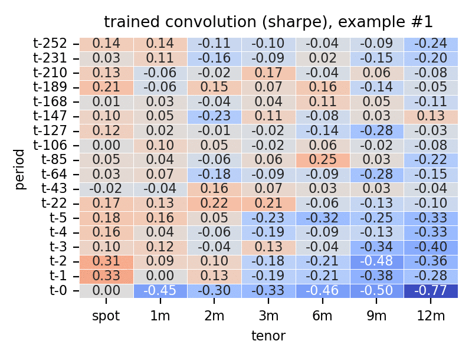

# fx term structure strategies using machine learning

The notebook with detailed walkthrough is in [demo.ipynb](./demo.ipynb). Dockerfile to be added soon.

## idea 

In this little piece, I aim to generalize popular forex trading strategies, such as carry and momentum, by leveraging machine learning techniques. I start with the observation that the signals for many such strategies can be extracted as a convolution of a suitable kernel with the log of the term structure history (TSH) of currencies. The TSH of currency _i_ is defined as an $L \times M$ matrix of log-spot and forward prices at different lags; for an illustration, consider the TSH for the Australian dollar as of May 5, 2023:


The kernel that we could use to extract the 1-month carry signal from this matrix takes the following form:


whereby a convolution is defined as common in the context of neural networks. In a similar fashion, the signals for the momentum (at different lags), curvature, basis momentum and other models can be extracted (also, smoothed).

This gives hope that the 'optimal' kernel(s) producing a profitable trading strategy can be learned from data rather than invented &ndash; an exercise akin to image recognition. The remaining components we need to accomplish this are a metric of profitability and corresponding functions that map signals to this metric.

A popular approach to constructing forex trading strategies is the periodically rebalanced long-short portfolio, where the assets of a high (low) signal value are held long (short). This approach can be approximated by using a modified softmax transformation $\sigma(s)$ of the signals $s$, whereby the modification makes the resulting portfolio weights range between -1 to 1 and exhibit a higher variance. For a gauge of the quality of the approximation, I present carry trades constructed both ways: the observed average correlation stands at 0.85.


A straightforward measure of profitability is the portfolio return: the dot product between the computed long/short positions and the subsequent excess returns of portfolio components. The negative of this serves as a loss function for our training purposes. The Sharpe ratio is another potential measure.

That being said, the simplest sequence of (importantly, differentiable) steps to go from a time-$t$ cross-section of TSHs to the value of the loss function looks as follows:

$$
\underset{[T \times (NM)]}{\text{TSH}} \overset{conv}{\longrightarrow} \underset{[1 \times N]}{s} 
    \overset{\sigma}{\longrightarrow} \underset{[1 \times N]}{w} 
    \overset{-dot(\cdot, \ r)}{\longrightarrow} \underset{[1 \times 1]}{l},
$$

where: 
- $T$ is the number of periods to look back from $t$; 
- $M$ is the number of tenors in each TSH; 
- $N$ is the number of assets; 
- $conv$ is the convolution with a suitable kernel;
- $s$ is the vector of signals; 
- $w$ is the vector of portfolio weights; 
- $r$ is the vector of forward-looking excess returns. 

Since each operation above is differentiable, a standard forward-pass + backward-propagation algorithm can be used to learn the optimal content of the kernel $conv$.

## data

Machine learning models are notoriously hungry for data, compelling my focus towards the most liquid currencies and tenors. The term structure history of G10 currencies at tenors of 1, 2, 3, 6, 9 and 12 months is observed daily from 1996 to 2023. I take audacity to pad the data a little by forward-filling missing observations up to two days ahead; unfortunately, even after this quite a few days must be excluded from the sample because of missing values somewhere in the TSH cross-section on those days. I also calculate daily values of 1-month excess returns $r$ by using current forward prices, settlement dates of 1-month forwards and the spot prices observed on those dates. 

## model

Specifying the term structure history, I include both long and short memory: 1 year at monthly intervals, and 1 week at daily ones. Hence, the list of (daily) lags looks as follows:

```python
lookback = [0, 1, 2, 3, 4, 5, 22, 43, 64, ..., 252]
```

I sample the cross-sections of these TSHs in batches, normalize each individual TSH as described above, and feed the whole cross-section to a convolutional neural network (CNN). The CNN consists of the single convolution layer with stride equal to the number of tenors, and the modified softmax for the activation function.

## results

For my simple model and the portfolio return as the loss function, it takes a mere of 10 epochs or so to converge to the optimum, as observed in the trajectories of the in-sample portfolio return in several models trained from scratch: 


Throughout the training process, the convolution kernel &ndash; originally initialized at random &ndash; evolves to exhibit a discernible structure. This transformation can be visualized through an animation charting the kernel's progression across the epochs, beginning from its initial state:


It is evident that the bottom right corner: today's 9- and 12-month forward prices, as well as the 12-month forward price history, is dominating the signal generation. This remains the general pattern across a plethora of models initialized at random and each supposedly converging to a different local optimum, as seen e.g. in the following animation looping through several fully trained models:


Another interesting pattern is the occasional prominence of the 't-127' row, corresponding to the period 6 months ago.

Using the Sharpe ratio for the loss function results in a very similar picture, showcased by a selection of fully trained layers below:

