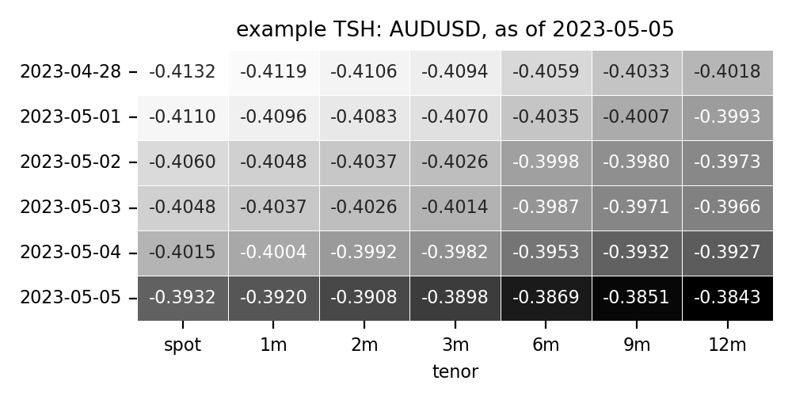
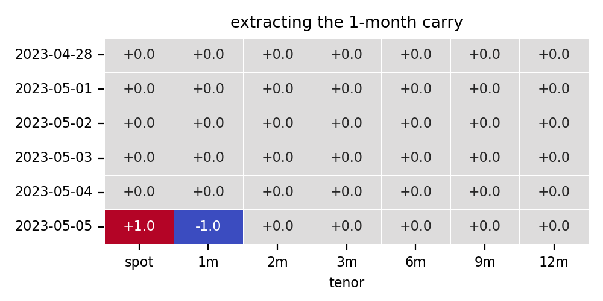

# fx term structure strategies using machine learning

The notebook with detailed walkthrough is in [demo.ipynb](./demo.ipynb).

## idea 
In this little piece I am trying to generalize popular fx trading strategies such as carry and momentum using machine learning methods. I start with noting that the signals for many such strategies can be derived using suitable convolutions on the log of the term structure history of currencies, or TSH. The TSH of currency _i_ is defined as the $L \times M$ matrix of log-spot and forward prices at different lags, for instance, below is the TSH for the Australian dollar on 2023-05-01:

If we would like to extract the 1-month carry signal from this matrix, we could convolve it (`pytorch`-style) with the following matrix:

In a similar fashion, it is possible to extract the momentum (at different lags), the curvature, the basis momentum and other linear signals, or a moving average thereof. The signals for several currencies can be extracted e.g. by stacking the respective TSHs horizontally and specifying the (left-to-right) stride of the convolution to equal the number of tenors.

This gives hope that the 'optimal' filter(s) which would result in a profitable trading strategy like carry can be learned from data rather than invented &ndash; an exercise akin to image recognition. The only missing pieces are a measure of profitability and the necessary functions to map the signals onto it.

A popular approach to constructing FX trading strategies is the periodically rebalanced long-short portfolio, in which the assets with a high (low) value of the signal are held long (short). A differentiable function that would produce something like this from a set of signals $s$ is the softmax, only slightly modified to range from -1 to 1 and have a higher variance than it normally would; let's call it $\sigma(s)$.

A measure of profitability could be just the dot product of the long/short positions thus calculated and the excess returns to be realized later; the negative of this is our loss function suitable for training. 

To sum up, here is the simplest architecture to go from a time-$t$ cross-section of TSHs to the value of the loss function:

$$
\underset{[T \times (NM)]}{TSH} \overset{conv}{\longrightarrow} \underset{[1 \times N]}{s} 
    \overset{\sigma}{\longrightarrow} \underset{[1 \times N]}{w} 
    \overset{-dot(\cdot, \ r)}{\longrightarrow} \underset{[1 \times 1]}{l},
$$

where $T$ is the number of periods to look back from $t$, $M$ is the number of tenors in each TSH, $N$ is the number of assets, $s$ is the vecor of signals, $w$ &ndash; of portfolio weights, and $r$ &ndash; of forward-looking returns. Since each operation above is differentiable, a standard forward-pass + backward-propagation algorithm can be used to learn the optimal structure of the convolution.

## data
