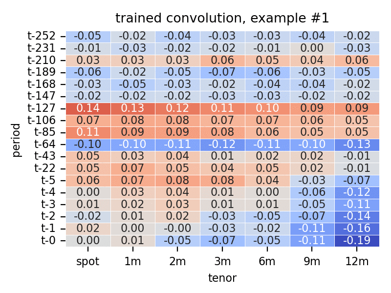

# fx term structure strategies using machine learning

The notebook with detailed walkthrough is in [demo.ipynb](./demo.ipynb). Dockerfile to be added soon.

## idea 
In this little piece I am trying to generalize popular fx trading strategies such as carry and momentum using machine learning methods. I start with noting that the signals for many such strategies can be derived using suitable convolutions on the log of the term structure history of currencies, or TSH. The TSH of currency _i_ is defined as the $L \times M$ matrix of log-spot and forward prices at different lags, for instance, below is the TSH for the Australian dollar on 2023-05-01:

<!--  -->


If we would like to extract the 1-month carry signal from this matrix, we could convolve it (`pytorch`-style) with the following matrix:

<!--  -->


In a similar fashion, it is possible to extract the momentum (at different lags), the curvature, the basis momentum and other linear signals, or a moving average thereof. The signals for several currencies can be extracted e.g. by stacking the respective TSHs horizontally and specifying the (left-to-right) stride of the convolution to equal the number of tenors.

This gives hope that the 'optimal' filter(s) which would result in a profitable trading strategy like carry can be learned from data rather than invented &ndash; an exercise akin to image recognition. The only missing pieces are a measure of profitability and the necessary functions to map the signals onto it.

A popular approach to constructing FX trading strategies is the periodically rebalanced long-short portfolio, in which the assets with a high (low) value of the signal are held long (short). A differentiable function that would produce something like this from a set of signals $s$ is the softmax, only slightly modified to range from -1 to 1 and have a higher variance than it normally would; let's call it $\sigma(s)$. To check if constructing a long-short strategy using the normalized softmax is similar to the good old rank-based way, below I plot monthly series of the carry trade done both ways. The average correlation is 0.85.

<!--  -->


A measure of profitability could be just the dot product of the long/short positions thus calculated and the excess returns to be realized later; the negative of this is our loss function suitable for training. 

To sum up, here is the simplest architecture to go from a time-$t$ cross-section of TSHs to the value of the loss function:

$$
\underset{[T \times (NM)]}{\text{TSH}} \overset{conv}{\longrightarrow} \underset{[1 \times N]}{s} 
    \overset{\sigma}{\longrightarrow} \underset{[1 \times N]}{w} 
    \overset{-dot(\cdot, \ r)}{\longrightarrow} \underset{[1 \times 1]}{l},
$$

where $T$ is the number of periods to look back from $t$, $M$ is the number of tenors in each TSH, $N$ is the number of assets, $s$ is the vector of signals, $w$ &ndash; of portfolio weights, and $r$ &ndash; of forward-looking returns. Since each operation above is differentiable, a standard forward-pass + backward-propagation algorithm can be used to learn the optimal structure of the convolution.

## data

As machine learning models are notoriously hungry for data, I have to stick to the most liquid currencies and tenors, and rely on overlapping observations. The 1-month excess returns $r$ used in the loss calculation are observed daily using the current forward prices, the settlement dates and the spot prices on those dates. The TSH for all currencies consist of the spot price and forward prices at the tenors of 1, 2, 3, 6, 9 and 12 months. I take audacity to pad the data a little, without introducing any look-ahead biases.

My data contains daily observations for G10 currencies from December 1996 to June 2023.

## model

The actual TSH I use looks back 1 year at monthly intervals, and 1 week at daily ones: 

```python
lookback = [0, 1, 2, 3, 4, 5, 22, 43, 64, ..., 252]
```

This has the intent of capturing long- and short-lived patterns. I sample the cross-sections of these TSHs in batches, normalize each as described above, and feed to the CNN consisting of the single convolution layer with stride equal to the number of tenors, and the modified softmax for the activation function.

## results

For my simple model, it takes a mere of 10 epochs or so to converge to the optimum, as shown in the dynamics of the in-sample return (which, remember, is the negative of the loss function): 

<!--  -->


By that time, the randomly initialized convolution filter receives increasingly more structure, as demonstrated in the following animation showing the filter over epochs since initialization (in the first frame):

<!--  -->


As apparent from the figure, today's forward price curve (row 't-0') is dominating the signal generation, especially its far end (6, 9 and 12 months). Of course, when initalized differently, the trained filter would also look different, as the model converges to another local minimum &ndash; but the stated above is true in general, as seen e.g. in the following loop across trained models, where the bottom right corner is more pronounced:


Another interesting pattern is the occasional prominence of the 't-127' row, corresponding to the period 6 months ago.